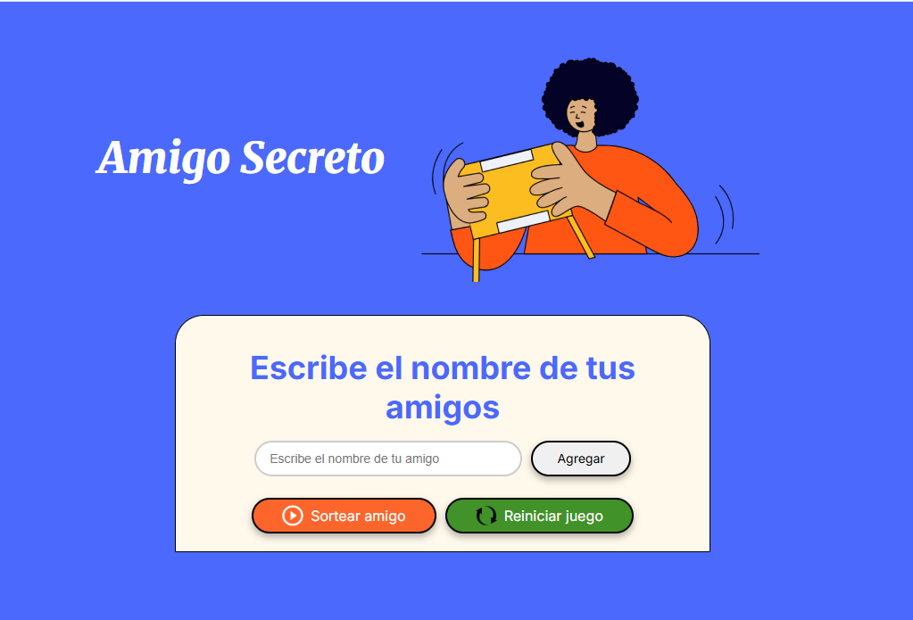

# challenge-amigo-secreto

Juego del amigo secreto

Un juego interactivo desarrollado en **JavaScript**, **HTML**, Y **CSS** que permite:

- Agregar nombres de amigos.
- Eliminar amigos de la lista.
- Sortear aleatoriamente un amigo secreto.
- Reiniciar el juego en cualquier momento.
- Recibir todas las notificaciones con **SweetAlert2** para una mejor experiencia visual.

## Vista previa del juego 

    

## Técnologias Usadas 

- **HTML**
- **CSS**
- **JavaScript**
- [SweetAlert2](https://sweetalert2.github.io/)

## Características

- **Interfaz amigable** y facil de usar.
- **SweetAlert2** para mensajes modernos.
- Botones estilizados con íconos.
- Capitalización automatica de nombres.
- Sorteos aleatorios.
- Reinicio del juego con un clic.

## Instalación (opciones)

1. Usa el siguiente enlace [Amigo secreto](https://ninojas.github.io/challenge-amigo-secreto/)
2. Clona este repositorio: https://github.com/NINOJAS/challenge-amigo-secreto.git 
   , abre el archivo index.html en tu navegador y ¡Disfruta jugando!.

## Como jugar 

1. Ingresa los nombres de los participantes.
2. Presiona el botón **"Sortear amigo"**.
3. El sistema seleccionará un amigo al azar.
4. Reiniciar el juego presionando el boton **"Reiniciar juego"**

## Personalización 

- Puedes cambiar colores y los tamaños de los botones en el archivo styel.css .
- los íconos se pueden cambiar en la carpeta assets.